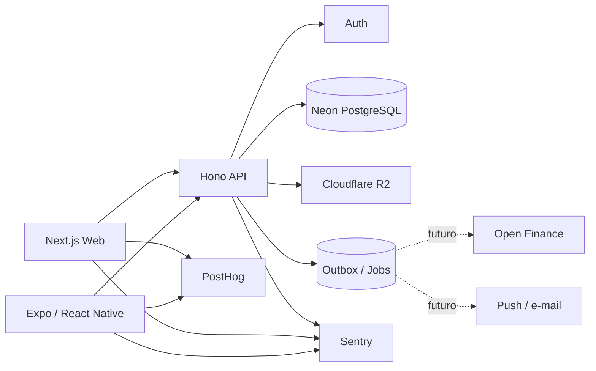

# DindIn — Engenharia, Arquitetura e Infraestrutura

> Status: **proposta recomendada para implementação**  
> Data de referência: **2026-09**

## 1. Objetivo

Este documento define como o DindIn deve ser construído tecnicamente depois da etapa de produto e design.

A prioridade é equilibrar cinco objetivos:

1. começar com custo de infraestrutura próximo de zero;
2. manter arquitetura profissional e compreensível;
3. evitar acoplamento excessivo a um fornecedor;
4. permitir web e mobile compartilharem domínio e contratos sem forçar a mesma UI;
5. escalar por necessidade real, sem adotar microserviços prematuramente.

A regra principal é:

> **Começar simples como um monólito modular, mas com fronteiras suficientes para crescer sem reescrever o produto.**

---

## 2. Decisão arquitetural principal

O DindIn deve iniciar como um **monólito modular orientado a domínio**, composto por três aplicações principais dentro de um monorepo:

- aplicação Web;
- aplicação Mobile;
- API central.

Web e Mobile **não acessam o banco diretamente** para operações de negócio. Ambos consomem a mesma API.

A API concentra:

- regras financeiras;
- autorização;
- validações;
- cálculos;
- auditoria;
- idempotência;
- integrações futuras.

Isso evita que uma regra como `Disponível para gastar` exista de maneira diferente no desktop, mobile ou em uma futura integração.

---

## 3. Stack recomendada

| Camada | Tecnologia | Decisão |
|---|---|---|
| Linguagem | TypeScript | padrão end-to-end |
| Monorepo | pnpm + Turborepo | uma base para web, mobile, API e packages |
| Web | Next.js | app desktop/tablet + landing/SEO |
| Mobile | React Native + Expo | Android e iOS com uma base |
| API | Hono | API leve, portável e adequada a edge/serverless |
| Contratos | Zod + OpenAPI | validação e contrato explícito da API |
| Banco | PostgreSQL no Neon | banco relacional, serverless e portável |
| ORM/query | Drizzle ORM | camada SQL tipada e leve |
| Autenticação | Neon Auth, atrás de abstração interna | login sem construir auth do zero |
| Arquivos | Cloudflare R2 | armazenamento S3-compatible |
| API hosting | Cloudflare Workers | serverless, barato e escalável |
| Web hosting inicial | Vercel no piloto não comercial | melhor DX para Next.js |
| Build mobile | Expo EAS | builds e distribuição |
| Server state | TanStack Query | cache, invalidação e sincronização |
| Formulários | React Hook Form + Zod | validação compartilhável |
| Estado local | React state; Zustand somente quando necessário | evitar Redux sem necessidade |
| Analytics produto | PostHog | funis, eventos e comportamento |
| Erros | Sentry | crash/error monitoring |
| CI/CD | GitHub Actions | qualidade, testes e deploy |

### Por que PostgreSQL

O domínio do DindIn é fortemente relacional:

- transações;
- orçamentos;
- parcelas;
- objetivos;
- planejamento mensal;
- relações entre períodos;
- histórico.

PostgreSQL oferece consistência transacional, constraints, índices, SQL analítico e portabilidade entre provedores.

---

## 4. Por que Neon como banco principal

Para o DindIn, a proposta recomenda Neon em vez de usar uma plataforma BaaS completa como centro da arquitetura.

Motivos:

- PostgreSQL padrão;
- escala para zero quando o banco está ocioso;
- autoscaling;
- branching de banco;
- bom encaixe com ambientes de preview e CI;
- caminho de crescimento baseado em uso;
- menor dependência de APIs proprietárias para dados de negócio.

A aplicação não deve depender de recursos exclusivos do Neon para a lógica financeira.

Se futuramente for necessário migrar para outro PostgreSQL, o domínio e o repositório de dados devem continuar válidos.

### Alternativa válida

Supabase continua sendo uma alternativa tecnicamente válida caso a prioridade mude para **reduzir o número de fornecedores** e ganhar Auth + Storage + Functions em uma única plataforma.

Para a arquitetura recomendada, porém, preferimos separar:

- compute/API;
- banco;
- storage;
- clientes.

Isso melhora portabilidade e deixa o domínio menos dependente do BaaS.

---

## 5. Diagrama de alto nível



---

## 6. Estrutura do monorepo

```text
DindIn/
├── apps/
│   ├── web/                 # Next.js
│   ├── mobile/              # Expo / React Native
│   └── api/                 # Hono
│
├── packages/
│   ├── domain/              # regras financeiras puras
│   ├── contracts/           # Zod + contratos da API
│   ├── db/                  # schema, queries e migrations
│   ├── auth/                # adaptação do provedor de identidade
│   ├── design-tokens/       # cores, tipografia, spacing
│   ├── analytics/           # eventos de produto
│   ├── config/              # configuração compartilhada
│   └── test-utils/          # fixtures e helpers
│
├── docs/
└── tooling/
```

### O que compartilhar

Compartilhar entre web e mobile:

- domínio;
- contratos;
- schemas;
- tipos;
- regras de cálculo;
- design tokens;
- analytics;
- utilitários.

### O que não compartilhar por obrigação

Não criar uma biblioteca universal de componentes apenas para “reutilizar código”.

O produto já definiu que:

> **Mobile não é dashboard reduzido. Desktop não é formulário ampliado.**

Portanto, Web e Mobile podem ter componentes diferentes quando isso melhorar a experiência.

---

## 7. Módulos de domínio

A API deve ser organizada por domínio, não por tipo técnico.

```text
modules/
├── identity/
├── profiles/
├── transactions/
├── categories/
├── budgets/
├── planning/
├── installments/
├── goals/
├── purchase-planning/
├── needs/
├── monthly-closing/
├── insights/
└── integrations/
```

### Regras

Cada módulo deve possuir suas próprias:

- regras de aplicação;
- validações;
- serviços;
- acesso a dados;
- testes.

Um módulo não deve consultar diretamente tabelas de outro módulo sem passar por uma fronteira de domínio definida.

---

## 8. Modelo financeiro e precisão

Dinheiro nunca deve usar `float` ou `double`.

Padrão recomendado:

```text
amount_minor BIGINT
currency CHAR(3)
```

Exemplo:

```text
R$ 512,34 -> amount_minor = 51234
currency = BRL
```

Isso evita erros binários de ponto flutuante.

Todos os cálculos financeiros importantes devem acontecer no domínio/API.

O frontend pode calcular valores apenas para preview visual, mas a API sempre é a autoridade final.

---

## 9. Identificadores, datas e fuso horário

- IDs: UUID gerado preferencialmente no cliente quando a operação precisar suportar retry/offline;
- timestamps persistidos em UTC;
- perfil guarda timezone do usuário;
- períodos financeiros utilizam uma referência explícita de mês/ano;
- operações críticas aceitam `idempotency_key`.

Para o piloto brasileiro, o produto trabalha inicialmente em BRL, mas o schema não deve impedir múltiplas moedas no futuro.

---

## 10. Estratégia de API

API REST versionada:

```text
/api/v1/...
```

Contratos publicados por OpenAPI.

Exemplos:

```text
POST /v1/transactions
GET  /v1/dashboard
GET  /v1/budgets
POST /v1/budgets
POST /v1/purchase-intents/analyze
GET  /v1/installments/forecast
POST /v1/months/:period/close
```

### Por que REST neste projeto

- fácil depuração;
- funciona bem com mobile e web;
- integrações futuras podem reutilizar endpoints;
- OpenAPI gera documentação;
- reduz acoplamento a um cliente TypeScript específico.

GraphQL não é necessário no MVP.

---

## 11. Segurança

O DindIn trabalha com informações financeiras pessoais. Segurança deve fazer parte da arquitetura desde o início.

### Regras obrigatórias

- nenhum segredo administrativo no frontend;
- tokens sensíveis nunca registrados em logs;
- TLS em todos os ambientes remotos;
- autorização baseada na identidade verificada pelo backend;
- toda consulta financeira inclui escopo do usuário;
- validação server-side em todas as mutações;
- rate limiting na API;
- CORS restrito;
- headers de segurança no web;
- trilha de auditoria para mutações financeiras relevantes;
- criptografia de backups;
- princípio de menor privilégio para credenciais.

### Defesa em profundidade

Mesmo sem acesso direto do cliente ao PostgreSQL, considerar Row Level Security para tabelas financeiras críticas.

A autorização da aplicação e a política do banco não devem depender apenas uma da outra.

---

## 12. Auditoria de dados

Não apagar silenciosamente histórico financeiro.

Entidades relevantes devem possuir:

```text
created_at
updated_at
created_by
updated_by
deleted_at (quando soft delete fizer sentido)
```

Para transações e ações críticas, manter registro de alterações ou eventos de auditoria.

O usuário pode corrigir uma movimentação, mas o sistema deve conseguir explicar o que foi alterado.

---

## 13. Offline seletivo

Offline completo não entra no primeiro marco técnico.

A arquitetura, porém, deve estar preparada para um modo offline seletivo no mobile.

Primeiro candidato:

> registrar uma despesa sem internet e sincronizar depois.

Para isso desde o início:

- IDs podem nascer no cliente;
- mutações são idempotentes;
- API tolera retry;
- timestamps distinguem momento do registro e momento do evento.

Quando implementado, usar Expo SQLite como outbox local.

---

## 14. Processos assíncronos

Não iniciar com RabbitMQ, Kafka ou microserviços.

Para o MVP:

- operações síncronas na API;
- tabela `outbox_events` para eventos que possam ser processados posteriormente;
- jobs agendados simples para fechamento, lembretes e manutenção.

Quando a carga justificar, a outbox pode alimentar Cloudflare Queues sem alterar o domínio.

---

## 15. Ambientes

Separação mínima:

```text
local
preview / test
development
production
```

### Banco

Usar projetos/branches Neon separados para impedir testes sobre dados reais.

### Frontend/API

Cada ambiente possui suas próprias variáveis e credenciais.

Produção nunca compartilha segredos ou banco com preview.

---

## 16. Deploy e infraestrutura

### API

Cloudflare Workers.

Vantagens para o projeto:

- zero servidor para administrar;
- escala automática;
- presença global;
- custo inicial zero dentro do free tier;
- caminho pago barato quando crescer.

### Storage

Cloudflare R2.

Usar para:

- anexos futuros;
- exportações;
- relatórios gerados;
- backups criptografados.

### Web

Durante o piloto pessoal e não comercial, Vercel Hobby é adequado para Next.js e oferece excelente fluxo de preview/deploy.

**Importante:** Vercel Hobby é restrito a uso pessoal/não comercial. Antes de monetização ou uso comercial, escolher uma das duas rotas:

1. Vercel Pro; ou
2. mover o web para infraestrutura Cloudflare compatível.

Essa decisão não altera domínio, API nem banco.

### Mobile

Expo EAS inicialmente no plano gratuito.

O custo das lojas é separado da infraestrutura e não é evitado pelo EAS.

---

## 17. CI/CD

Fluxo recomendado:

```text
feature branch
    ↓
Pull Request
    ↓
lint + format check
    ↓
typecheck
    ↓
unit tests
    ↓
integration tests
    ↓
build web/api
    ↓
E2E essencial
    ↓
review
    ↓
merge main
    ↓
deploy production
```

### Estratégia Git

Preferir trunk-based development:

- `main` sempre publicável;
- branches curtas;
- Pull Request obrigatório;
- sem branch `develop` longa;
- releases mobile recebem tags.

---

## 18. Qualidade e testes

### Camadas

**Unitários**

Prioridade máxima para regras financeiras:

- cálculo do disponível;
- orçamento acumulável;
- parcelamento;
- planejamento;
- impacto de compra;
- fechamento mensal.

**Integração**

Testar API + PostgreSQL real em ambiente isolado.

**Web E2E**

Playwright.

**Mobile E2E**

Maestro ou equivalente open-source, quando o fluxo estiver estável.

### Regra

Uma regra financeira sem teste automatizado é considerada incompleta.

---

## 19. Observabilidade

Desde o beta:

- erros e crashes;
- logs estruturados;
- request ID;
- métricas de latência da API;
- eventos de produto;
- alertas para falha de jobs;
- monitoramento de consumo dos free tiers.

### Eventos de produto importantes

Exemplos:

```text
month_plan_created
expense_created
budget_exceeded
purchase_analyzed
purchase_postponed
installment_finished
released_money_reallocated
month_closed
```

Analytics não deve receber descrição privada de transações ou informação financeira sensível desnecessária.

---

## 20. Backup e recuperação

Free tier não elimina a necessidade de backup.

Estratégia recomendada para o piloto:

- usar capacidade de restore nativa do banco como primeira camada;
- executar `pg_dump` periódico;
- compactar e criptografar o arquivo;
- enviar para bucket privado no R2;
- manter retenção limitada;
- realizar teste periódico de restauração.

Backup que nunca foi restaurado em teste não deve ser considerado confiável.

---

## 21. LGPD e privacidade

Princípios técnicos:

- coletar somente dados necessários;
- permitir exclusão de conta;
- permitir exportação de dados;
- definir retenção;
- não enviar dados financeiros completos para analytics;
- separar dados de autenticação de dados de observabilidade;
- documentar terceiros que processam dados;
- preparar política de privacidade antes do beta público.

Integrações Open Finance exigirão uma revisão específica de segurança e compliance antes de serem implementadas.

---

## 22. Infraestrutura inicial — custo alvo

O objetivo do piloto é manter infraestrutura em **R$ 0**, respeitando limites de uso dos planos gratuitos.

Base proposta:

| Serviço | Uso | Piloto |
|---|---|---|
| GitHub | código + CI/CD | gratuito dentro da cota aplicável |
| Neon | PostgreSQL + Auth | free tier |
| Cloudflare Workers | API | free tier |
| Cloudflare R2 | objetos/backups | free tier |
| Vercel | web piloto não comercial | Hobby |
| Expo EAS | builds | free tier |
| PostHog | analytics | free tier |
| Sentry | erros | Developer/free |

### Exceções que não são infraestrutura do app

Publicação nas lojas possui taxas próprias:

- Google Play Console: taxa única;
- Apple Developer Program: taxa anual.

---

## 23. Caminho de escala

### Fase A — piloto

Poucos usuários, entrada manual e validação do comportamento.

Infraestrutura praticamente gratuita.

### Fase B — beta controlado

Dezenas/centenas de usuários.

Adicionar:

- observabilidade mais rigorosa;
- backup automatizado;
- offline seletivo;
- push notifications;
- rate limits por usuário;
- testes de carga.

### Fase C — produto público

Migrar apenas os serviços que ultrapassarem o free tier.

Possíveis primeiras despesas:

- compute da API;
- banco;
- web comercial;
- builds/distribuição mobile.

### Fase D — escala

Somente após métricas reais:

- filas;
- cache distribuído;
- read replicas;
- jobs dedicados;
- extração de serviços muito específicos.

Não criar microserviços apenas porque o número de usuários aumentou.

---

## 24. O que não fazer

Evitar no primeiro release:

- Kubernetes;
- microsserviços;
- event sourcing completo;
- GraphQL sem necessidade;
- múltiplos bancos para o mesmo domínio;
- Redis apenas “porque todo SaaS usa”;
- abstrações genéricas sem caso real;
- compartilhamento forçado de componentes Web/Mobile;
- regra financeira escrita dentro de componente React;
- acesso direto do cliente ao banco para mutações críticas;
- dependência de cálculo financeiro apenas no frontend.

---

## 25. Ordem recomendada de implementação técnica

1. estruturar monorepo;
2. configurar lint, typecheck e testes;
3. criar `packages/domain` e `packages/contracts`;
4. provisionar Neon development/production;
5. criar schema base e migrations;
6. configurar autenticação;
7. subir API Hono no Cloudflare Workers;
8. implementar primeiro vertical slice: login → planejamento → dashboard;
9. conectar Next.js;
10. conectar Expo;
11. instrumentar Sentry/PostHog;
12. configurar CI/CD;
13. configurar backup;
14. avançar feature por feature.

A implementação deve ser feita por **vertical slices**. Não construir todo o banco, depois toda a API e somente no final a interface.

---

## 26. Primeiro vertical slice recomendado

```text
Criar conta / entrar
        ↓
criar perfil
        ↓
definir renda do mês
        ↓
criar uma obrigação
        ↓
criar um orçamento
        ↓
registrar uma despesa
        ↓
recalcular disponível
        ↓
mostrar Dashboard
```

Se esse slice estiver funcionando de ponta a ponta, a fundação arquitetural está validada.

---

## 27. Critérios para considerar a fundação pronta

A fundação técnica estará pronta quando:

- Web e Mobile autenticarem contra a mesma identidade;
- ambos consumirem a mesma API;
- migrations forem reprodutíveis;
- nenhum cálculo financeiro crítico estiver duplicado em frontend;
- CI bloquear regressões básicas;
- produção estiver separada de desenvolvimento;
- logs não vazarem dados financeiros;
- backups puderem ser restaurados;
- o primeiro vertical slice funcionar em produção;
- um novo desenvolvedor conseguir entender o projeto apenas pelo repositório e documentação.
