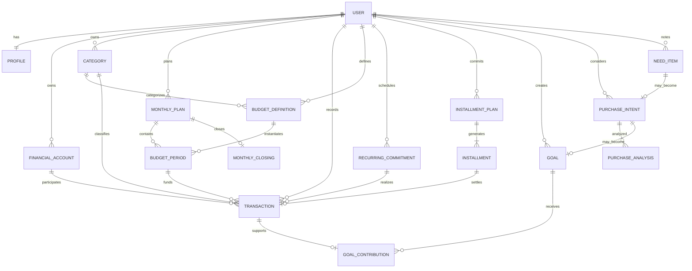

# DindIn — Modelagem de Dados e Contratos do Domínio

> Status: **proposta para validação antes das migrations**  
> Data de referência: **2026-09**

## 1. Objetivo

Este documento transforma os conceitos de produto do DindIn em um modelo de domínio e em uma proposta relacional para PostgreSQL.

Ele define:

- entidades e responsabilidades;
- relações entre módulos;
- invariantes financeiras;
- estados e ciclos de vida;
- valores derivados;
- estratégia de histórico e auditoria;
- estrutura inicial de tabelas;
- fronteiras dos contratos da API;
- pontos que devem permanecer derivados, em vez de persistidos.

Ainda **não é uma migration** e não deve ser convertido automaticamente em schema sem revisão.

A regra principal é:

> **Persistir fatos e decisões; calcular projeções e indicadores a partir deles.**

---

# 2. Princípios da modelagem

## 2.1 O banco representa o domínio, não as telas

Não criar tabelas porque existe um card, gráfico ou tela.

A interface é uma projeção do domínio. O modelo deve continuar válido mesmo que a UI mude completamente.

## 2.2 Valores financeiros em unidades menores inteiras

Conforme ADR-017:

```text
amount_minor BIGINT
currency CHAR(3)
```

Exemplo:

```text
R$ 512,34 = 51234 BRL
```

Nenhum valor monetário crítico deve usar `float` ou `double`.

## 2.3 Fatos financeiros não são apagados silenciosamente

Transações, contribuições, parcelas pagas e fechamentos não devem desaparecer por `DELETE` comum.

Quando houver necessidade de correção:

- transação pode ser anulada (`voided`);
- entidade de configuração pode ser arquivada;
- alterações relevantes deixam trilha de auditoria.

## 2.4 Multi-tenant por usuário desde o início

Toda entidade financeira pertencente ao usuário deve carregar `user_id` diretamente ou possuir cadeia de ownership inequívoca.

Isso facilita:

- autorização;
- índices;
- RLS como defesa em profundidade;
- exportação e exclusão de dados por titular.

## 2.5 UTC para timestamps; período financeiro explícito

Timestamps técnicos são persistidos em UTC.

Mês financeiro não deve ser inferido apenas de `created_at`.

Usar uma referência explícita como:

```text
period_year  = 2026
period_month = 9
```

ou `period_start = 2026-09-01` quando isso simplificar consultas.

## 2.6 Valores derivados não viram fonte da verdade sem necessidade

Exemplos que devem ser calculados:

- disponível para gastar;
- orçamento restante;
- percentual utilizado;
- comprometimento futuro;
- total gasto no mês;
- progresso de objetivo.

Caches/materialized views poderão existir depois, mas não substituem os fatos originais.

---

# 3. Bounded contexts / módulos

A modelagem segue as fronteiras de domínio definidas na arquitetura.

```text
identity
profiles
accounts
categories
transactions
budgets
planning
installments
goals
purchase-planning
needs
monthly-closing
insights
audit
integrations
```

As fronteiras são lógicas dentro do monólito modular. Não representam bancos ou microserviços separados.

---

# 4. Visão conceitual

O DindIn trabalha com três tipos diferentes de informação que não devem ser confundidos.

## 4.1 Dinheiro real movimentado

Representado principalmente por `transactions`.

Responde:

> O que efetivamente entrou, saiu ou foi transferido?

## 4.2 Dinheiro planejado

Representado por `monthly_plans`, `budget_definitions` e `budget_periods`.

Responde:

> Qual função o usuário deu para o dinheiro deste mês?

## 4.3 Compromissos futuros

Representados por `recurring_commitments`, `installment_plans` e `installments`.

Responde:

> Quanto da renda futura já está comprometido?

Essa separação é essencial para não tratar planejamento como movimentação real.

---

# 5. Modelo conceitual de alto nível



---

# 6. Identidade e perfil

## 6.1 `profiles`

O provedor de autenticação administra identidade técnica. O DindIn mantém seu perfil de domínio separado.

Campos principais:

```text
user_id               UUID PK
name                  TEXT
locale                TEXT            default 'pt-BR'
timezone              TEXT            default 'America/Sao_Paulo'
default_currency      CHAR(3)         default 'BRL'
financial_month_day   SMALLINT        nullable
created_at            TIMESTAMPTZ
updated_at            TIMESTAMPTZ
```

### `financial_month_day`

Permite futuramente tratar usuários cujo ciclo financeiro acompanha salário/fatura e não necessariamente o primeiro dia do mês.

No MVP pode permanecer `null`, significando mês-calendário.

---

# 7. Contas e fontes de dinheiro

## 7.1 `financial_accounts`

Representa onde o dinheiro está ou por onde uma movimentação ocorre.

Exemplos:

- conta corrente;
- poupança;
- carteira/dinheiro;
- conta digital;
- cartão de crédito como fonte de pagamento;
- conta virtual usada para organização.

Campos principais:

```text
id                    UUID PK
user_id               UUID FK
name                  TEXT
account_type          TEXT
currency              CHAR(3)
include_in_net_cash   BOOLEAN
is_active             BOOLEAN
archived_at           TIMESTAMPTZ nullable
created_at            TIMESTAMPTZ
updated_at            TIMESTAMPTZ
version               INTEGER
```

`account_type` inicial:

```text
checking
savings
cash
wallet
credit_card
other
```

### Regra

Saldo bancário não é a fonte do `Disponível para gastar`.

Conta existe para registrar origem/destino real. Disponibilidade é conceito de planejamento.

---

# 8. Categorias

## 8.1 `categories`

Categorias classificam movimentações e podem ser associadas a orçamentos.

Campos:

```text
id                    UUID PK
user_id               UUID FK
name                  TEXT
category_kind         TEXT
parent_id             UUID nullable
icon_key              TEXT nullable
is_system             BOOLEAN
is_active             BOOLEAN
archived_at           TIMESTAMPTZ nullable
created_at            TIMESTAMPTZ
updated_at            TIMESTAMPTZ
```

`category_kind`:

```text
income
expense
transfer
```

Categorias de sistema podem fornecer uma base inicial, mas o usuário pode criar categorias próprias.

Categorias usadas historicamente devem ser arquivadas, não removidas.

---

# 9. Movimentações reais

## 9.1 `transactions`

É a principal tabela de fatos financeiros.

Campos propostos:

```text
id                       UUID PK
user_id                  UUID FK
transaction_type         TEXT
status                   TEXT
amount_minor             BIGINT
currency                 CHAR(3)
description              TEXT nullable
category_id              UUID nullable
source_account_id        UUID nullable
destination_account_id   UUID nullable
budget_period_id         UUID nullable
recurring_commitment_id  UUID nullable
occurred_at              TIMESTAMPTZ
local_date               DATE
source_type              TEXT
external_reference       TEXT nullable
notes                    TEXT nullable
voided_at                TIMESTAMPTZ nullable
void_reason              TEXT nullable
created_at               TIMESTAMPTZ
updated_at               TIMESTAMPTZ
version                  INTEGER
```

### `transaction_type`

```text
income
expense
transfer
```

### `status`

```text
pending
posted
voided
```

### `source_type`

```text
manual
recurring
installment
import
integration
system
```

### Invariantes

#### Receita

```text
amount_minor > 0
destination_account_id obrigatório quando houver conta
```

#### Despesa

```text
amount_minor > 0
source_account_id obrigatório quando houver conta
```

#### Transferência

```text
source_account_id != destination_account_id
category_id normalmente null
não conta como receita nem despesa do usuário
```

### Regra de correção

Uma transação financeira confirmada deve ser anulada/corrigida em vez de simplesmente apagada.

---

# 10. Planejamento mensal

## 10.1 `monthly_plans`

Representa o ato de “Montar meu mês”.

Campos:

```text
id                       UUID PK
user_id                  UUID FK
period_year              SMALLINT
period_month             SMALLINT
status                   TEXT
expected_income_minor    BIGINT
currency                 CHAR(3)
activated_at             TIMESTAMPTZ nullable
closed_at                TIMESTAMPTZ nullable
created_at               TIMESTAMPTZ
updated_at               TIMESTAMPTZ
version                  INTEGER
```

Constraint:

```text
UNIQUE(user_id, period_year, period_month)
```

Estados:

```text
draft
active
closed
```

### Regra

`expected_income_minor` representa capacidade prevista do período. Receita real continua vindo de `transactions`.

---

# 11. Orçamentos

A modelagem separa a **definição duradoura** do orçamento da **instância mensal**.

## 11.1 `budget_definitions`

Exemplos:

- Mercado;
- Compras pessoais;
- Moradia;
- Reserva de emergência;
- Necessidades futuras.

Campos:

```text
id                 UUID PK
user_id            UUID FK
name               TEXT
budget_kind        TEXT
spendability       TEXT
category_id        UUID nullable
goal_id            UUID nullable
rollover_mode      TEXT
is_active          BOOLEAN
archived_at        TIMESTAMPTZ nullable
created_at         TIMESTAMPTZ
updated_at         TIMESTAMPTZ
```

`budget_kind`:

```text
obligation
consumption
reserve
future_need
goal
free
```

`spendability`:

```text
spendable
protected
```

`rollover_mode`:

```text
none
positive_only
full
```

## 11.2 `budget_periods`

Instância mensal do orçamento.

Campos:

```text
id                    UUID PK
user_id               UUID FK
monthly_plan_id       UUID FK
budget_definition_id  UUID FK
planned_minor         BIGINT
carried_in_minor      BIGINT default 0
manual_adjust_minor   BIGINT default 0
created_at            TIMESTAMPTZ
updated_at            TIMESTAMPTZ
version               INTEGER
```

Constraint:

```text
UNIQUE(monthly_plan_id, budget_definition_id)
```

### Valores derivados

Não persistir como fonte de verdade:

```text
used_minor
remaining_minor
usage_percent
```

Cálculo:

```text
capacity = planned_minor + carried_in_minor + manual_adjust_minor
used = soma das expenses posted ligadas ao budget_period
remaining = capacity - used
```

### Por que transação possui `budget_period_id`

A categoria explica **o que foi gasto**.

O orçamento explica **de qual envelope planejado aquele gasto saiu**.

Na maioria dos casos a associação pode ser automática pela categoria, mas manter a ligação explícita evita ambiguidades futuras.

---

# 12. Disponível para gastar

`Disponível para gastar` é um **valor derivado**, nunca uma coluna editável.

A fonte principal, quando existe planejamento ativo, é:

```text
available_to_spend =
    soma(remaining de budget_periods com spendability = 'spendable')
    + saldo ainda não distribuído que a política permitir tratar como livre
```

Orçamentos protegidos não entram nesse valor.

Exemplos protegidos:

- reserva de emergência;
- objetivo;
- obrigação ainda não paga;
- valor reservado para compromisso futuro.

### `unassigned_minor`

Também derivado:

```text
unassigned = expected_income
             + carryovers aplicáveis
             - soma de todas as alocações do monthly_plan
```

Ideal educativo:

```text
unassigned = 0
```

Isso não significa gastar tudo. Significa dar função a todo dinheiro.

### Modo sem planejamento

Enquanto não houver plano ativo, a Home pode exibir uma estimativa provisória baseada em receitas, despesas e compromissos conhecidos, mas deve comunicar que o mês ainda não foi planejado.

Essa estimativa não deve se tornar regra paralela permanente.

---

# 13. Compromissos recorrentes

## 13.1 `recurring_commitments`

Representa compromissos como:

- moradia;
- mensalidade;
- assinatura;
- despesa fixa.

Campos:

```text
id                   UUID PK
user_id              UUID FK
name                 TEXT
category_id          UUID FK
account_id           UUID nullable
amount_minor         BIGINT
currency             CHAR(3)
frequency            TEXT
start_date           DATE
end_date             DATE nullable
day_of_month         SMALLINT nullable
is_active            BOOLEAN
created_at           TIMESTAMPTZ
updated_at           TIMESTAMPTZ
version              INTEGER
```

No primeiro ciclo:

```text
frequency = monthly
```

A arquitetura pode aceitar outros padrões depois.

### Regra

Recorrência é previsão/compromisso. Só vira gasto realizado quando existir uma `transaction` correspondente.

---

# 14. Parcelamentos

Parcelamento precisa representar renda futura comprometida explicitamente.

## 14.1 `installment_plans`

Campos:

```text
id                    UUID PK
user_id               UUID FK
name                  TEXT
category_id           UUID nullable
account_id            UUID nullable
total_amount_minor    BIGINT
currency              CHAR(3)
installment_count     INTEGER
first_due_date        DATE
status                TEXT
created_at            TIMESTAMPTZ
updated_at            TIMESTAMPTZ
version               INTEGER
```

Estados:

```text
active
completed
cancelled
```

## 14.2 `installments`

Campos:

```text
id                    UUID PK
user_id               UUID FK
installment_plan_id   UUID FK
installment_number    INTEGER
due_date              DATE
amount_minor          BIGINT
status                TEXT
paid_transaction_id   UUID nullable
paid_at               TIMESTAMPTZ nullable
created_at            TIMESTAMPTZ
updated_at            TIMESTAMPTZ
```

Constraint:

```text
UNIQUE(installment_plan_id, installment_number)
```

Estados:

```text
planned
paid
cancelled
```

### Regra de arredondamento

O total das parcelas deve ser exatamente igual ao total do plano.

Se uma divisão não for exata, a diferença de centavos deve ser absorvida de forma determinística, preferencialmente pela última parcela.

### Valor derivado

Comprometimento futuro de um mês:

```text
soma(installments.amount_minor
     where status = planned
     and due_date pertence ao mês)
+
soma(outros compromissos recorrentes previstos)
```

---

# 15. Objetivos e reservas

## 15.1 `goals`

Campos:

```text
id                    UUID PK
user_id               UUID FK
name                  TEXT
goal_type             TEXT
target_amount_minor   BIGINT
target_date           DATE nullable
currency              CHAR(3)
status                TEXT
created_at            TIMESTAMPTZ
updated_at            TIMESTAMPTZ
version               INTEGER
```

`goal_type` inicial:

```text
emergency_fund
purchase
travel
education
other
```

Estados:

```text
active
completed
paused
cancelled
```

## 15.2 `goal_contributions`

Campos:

```text
id                    UUID PK
user_id               UUID FK
goal_id               UUID FK
amount_minor          BIGINT
transaction_id        UUID nullable
contributed_at        TIMESTAMPTZ
source_type           TEXT
created_at            TIMESTAMPTZ
```

### Valor derivado

```text
goal_current_amount = soma(goal_contributions.amount_minor válidas)
```

Não persistir progresso percentual como fonte da verdade.

---

# 16. Quero comprar

## 16.1 `purchase_intents`

Representa intenção antes da compra.

Campos:

```text
id                         UUID PK
user_id                    UUID FK
title                      TEXT
estimated_amount_minor     BIGINT
currency                   CHAR(3)
need_level                 TEXT
needed_by                  DATE nullable
payment_mode               TEXT
planned_installments       INTEGER nullable
category_id                UUID nullable
status                     TEXT
linked_goal_id             UUID nullable
purchased_transaction_id   UUID nullable
created_at                 TIMESTAMPTZ
updated_at                 TIMESTAMPTZ
version                    INTEGER
```

`need_level`:

```text
need
want
unsure
```

`payment_mode`:

```text
cash
installment
undecided
```

Estados:

```text
draft
analyzed
planned
purchased
cancelled
```

## 16.2 `purchase_analyses`

Análises devem ser persistidas como snapshots explicáveis.

Campos principais:

```text
id                         UUID PK
user_id                    UUID FK
purchase_intent_id         UUID FK
rule_version               TEXT
available_before_minor     BIGINT
available_after_minor      BIGINT
budget_remaining_minor     BIGINT nullable
budget_shortfall_minor     BIGINT nullable
monthly_commitment_minor   BIGINT nullable
commitment_months          INTEGER nullable
reserve_impact_minor       BIGINT nullable
recommendation_code        TEXT
explanation_payload        JSONB
created_at                 TIMESTAMPTZ
```

### Por que persistir a análise

O usuário deve conseguir entender qual informação levou a uma recomendação anterior mesmo que seu mês mude depois.

`rule_version` permite evoluir o motor de análise sem reescrever o passado.

### JSONB

`explanation_payload` é aceitável como snapshot de explicação.

Não deve substituir campos estruturados necessários para consultas e regras.

---

# 17. Coisas que estão faltando

## 17.1 `need_items`

Campos:

```text
id                       UUID PK
user_id                  UUID FK
title                    TEXT
estimated_amount_minor   BIGINT nullable
currency                 CHAR(3)
category_id              UUID nullable
urgency                  TEXT
needed_by                DATE nullable
status                   TEXT
purchase_intent_id       UUID nullable
created_at               TIMESTAMPTZ
updated_at               TIMESTAMPTZ
```

`urgency`:

```text
low
medium
high
```

Estados:

```text
open
planned
purchased
dismissed
```

### Evolução

Um `need_item` pode virar:

- orçamento futuro;
- `purchase_intent`;
- objetivo;
- compra realizada.

---

# 18. Fechamento mensal

## 18.1 `monthly_closings`

Fechamento é um snapshot histórico da interpretação do mês.

Campos:

```text
id                       UUID PK
user_id                  UUID FK
monthly_plan_id          UUID FK
snapshot_version         INTEGER
income_minor             BIGINT
expense_minor            BIGINT
reserved_minor           BIGINT
spendable_end_minor      BIGINT
unassigned_end_minor     BIGINT
snapshot_payload         JSONB
closed_at                TIMESTAMPTZ
invalidated_at           TIMESTAMPTZ nullable
created_at               TIMESTAMPTZ
```

Constraint inicial:

```text
UNIQUE(monthly_plan_id, snapshot_version)
```

### Estratégia

O fechamento não precisa bloquear permanentemente correções em meses passados.

Se um fato financeiro do período for alterado depois do fechamento:

1. snapshot anterior permanece para histórico;
2. fechamento pode ser marcado como `invalidated_at`;
3. usuário pode gerar nova versão.

Assim evitamos alterar silenciosamente uma retrospectiva já apresentada.

---

# 19. Auditoria

## 19.1 `audit_events`

Não é event sourcing.

Serve para rastrear mudanças relevantes.

Campos:

```text
id              UUID PK
user_id         UUID nullable
actor_user_id   UUID nullable
entity_type     TEXT
entity_id       UUID
action          TEXT
before_payload  JSONB nullable
after_payload   JSONB nullable
request_id      TEXT nullable
created_at      TIMESTAMPTZ
```

Eventos relevantes:

- transação anulada;
- orçamento replanejado;
- plano mensal ativado;
- fechamento criado/inutilizado;
- parcela alterada;
- valor protegido realocado.

Dados sensíveis devem ser minimizados mesmo na auditoria.

---

# 20. Idempotência

## 20.1 `idempotency_keys`

Infraestrutura de API para operações mutáveis críticas.

Campos:

```text
user_id          UUID
key              TEXT
operation        TEXT
request_hash     TEXT
response_code    INTEGER
response_body    JSONB
expires_at       TIMESTAMPTZ
created_at       TIMESTAMPTZ
```

Constraint:

```text
UNIQUE(user_id, key, operation)
```

Especialmente importante para:

- criação de despesa;
- criação de receita;
- sincronização mobile;
- pagamento de parcela;
- contribuição para objetivo.

---

# 21. Outbox para integrações futuras

## 21.1 `outbox_events`

Evita acoplar transações financeiras diretamente a tarefas assíncronas.

Campos:

```text
id             UUID PK
aggregate_type TEXT
aggregate_id   UUID
event_type     TEXT
payload        JSONB
occurred_at    TIMESTAMPTZ
processed_at   TIMESTAMPTZ nullable
attempts       INTEGER default 0
```

Exemplos futuros:

```text
transaction.created
budget.exceeded
installment.completed
month.closed
purchase.analysis.created
```

O MVP pode começar usando a tabela apenas onde houver necessidade real.

---

# 22. Invariantes de domínio

## 22.1 Dinheiro

- `amount_minor > 0` para fatos monetários normais;
- moeda é explícita;
- nenhuma regra financeira usa ponto flutuante.

## 22.2 Ownership

- nenhuma entidade financeira pode referenciar objeto pertencente a outro usuário;
- isso deve ser validado na aplicação e, quando possível, reforçado no banco.

## 22.3 Orçamento

- apenas um `budget_period` por definição no mesmo plano mensal;
- `remaining` pode ser negativo;
- orçamento estourado não invalida a transação;
- gasto acima do orçamento exige orientação, não bloqueio automático.

## 22.4 Planejamento

- apenas um `monthly_plan` por usuário/período;
- um plano fechado não recebe alterações silenciosas;
- reabertura/replanejamento deve ficar auditável.

## 22.5 Parcelas

- soma das parcelas = total do plano;
- número da parcela fica entre `1` e `installment_count`;
- parcela paga referencia no máximo uma transação de liquidação.

## 22.6 Objetivos

- contribuição nunca possui valor negativo;
- correção é registrada como estorno/ajuste, não valor negativo oculto.

## 22.7 Transferências

- não contam simultaneamente como receita e despesa do usuário;
- origem e destino não podem ser iguais.

---

# 23. Índices iniciais

Índices devem seguir consultas reais, mas alguns são previsíveis desde o início.

Sugestões:

```text
transactions(user_id, local_date DESC)
transactions(user_id, category_id, local_date DESC)
transactions(user_id, budget_period_id)
transactions(user_id, status, local_date)

monthly_plans(user_id, period_year, period_month)

budget_periods(monthly_plan_id)
budget_periods(user_id, budget_definition_id)

installments(user_id, due_date, status)
installments(installment_plan_id, installment_number)

goals(user_id, status)
goal_contributions(goal_id, contributed_at)

purchase_intents(user_id, status, created_at DESC)
purchase_analyses(purchase_intent_id, created_at DESC)

need_items(user_id, status, needed_by)
```

Evitar criar dezenas de índices preventivamente.

---

# 24. Estratégia de constraints

Preferir integridade no PostgreSQL quando a regra for local e determinística.

Exemplos:

- `CHECK amount_minor > 0`;
- `CHECK period_month BETWEEN 1 AND 12`;
- unique constraints;
- foreign keys;
- `NOT NULL` onde o domínio realmente exige.

Regras que dependem de múltiplos agregados ou decisões de negócio ficam no domínio/API.

Não transformar triggers em camada escondida de negócio.

---

# 25. Enums: decisão recomendada

Não usar PostgreSQL ENUM para toda classificação do sistema no primeiro ciclo.

Preferir:

```text
TEXT/VARCHAR
+ CHECK constraint
+ enum TypeScript/Zod
```

Motivos:

- migrations mais simples;
- maior portabilidade;
- evolução de estados com menor atrito.

PostgreSQL ENUM pode ser usado futuramente quando um conjunto for realmente estável e justificar.

---

# 26. Soft delete e arquivamento

Não usar `deleted_at` indiscriminadamente em todas as tabelas.

Estratégia:

### Entidades configuráveis

Exemplos:

- categoria;
- conta;
- orçamento.

Usar `archived_at` / `is_active`.

### Fatos financeiros

Exemplos:

- transações;
- contribuições;
- parcelas pagas.

Usar estados de anulação/correção e auditoria.

### Dados transitórios

Rascunhos ainda não utilizados podem ser removidos fisicamente quando isso não destrói histórico relevante.

---

# 27. Concorrência

Entidades editáveis relevantes terão `version INTEGER` para optimistic concurrency.

Exemplo:

```text
UPDATE monthly_plans
SET ..., version = version + 1
WHERE id = :id
  AND version = :expectedVersion
```

Se nenhuma linha for alterada, a API retorna conflito e o cliente precisa recarregar.

Isso é especialmente útil em:

- planejamento mensal;
- orçamentos;
- objetivos;
- intenções de compra.

---

# 28. Contratos de domínio iniciais

Os contratos HTTP finais serão detalhados depois, mas a modelagem já define comandos principais.

## Transactions

```text
CreateExpense
CreateIncome
CreateTransfer
VoidTransaction
ListTransactions
```

## Planning

```text
CreateMonthlyPlan
UpdateExpectedIncome
ActivateMonthlyPlan
GetMonthlyPlanSummary
CloseMonthlyPlan
```

## Budgets

```text
CreateBudgetDefinition
SetBudgetPeriodAllocation
ReallocateBudget
GetBudgetStatus
```

## Installments

```text
CreateInstallmentPlan
RecordInstallmentPayment
GetFutureCommitments
```

## Goals

```text
CreateGoal
ContributeToGoal
PauseGoal
CompleteGoal
```

## Purchase Planning

```text
CreatePurchaseIntent
AnalyzePurchase
PlanPurchase
MarkPurchaseCompleted
```

## Needs

```text
CreateNeedItem
ConvertNeedToPurchaseIntent
DismissNeedItem
```

## Closing

```text
GenerateMonthlyClosing
InvalidateMonthlyClosing
GetClosingHistory
```

---

# 29. Read models / projeções da API

Não obrigar o frontend a juntar dezenas de tabelas.

A API deve fornecer read models orientados à experiência.

Exemplos:

## `DashboardSummary`

```text
period
availableToSpend
incomeReceived
expensePosted
protectedAmount
unassignedAmount
budgetHighlights[]
futureCommitments[]
nextInstallments[]
insights[]
```

## `BudgetStatus`

```text
budgetId
name
kind
capacity
used
remaining
usagePercent
status
recentTransactions[]
```

## `PurchaseAnalysisResult`

```text
availableBefore
availableAfter
budgetImpact
reserveImpact
futureCommitment
recommendation
alternatives[]
ruleVersion
```

Esses objetos são contratos da aplicação, não novas tabelas obrigatórias.

---

# 30. O que não entra no schema inicial

Não antecipar complexidade para funcionalidades não validadas.

Ficam fora do primeiro schema:

- Open Finance;
- conciliação bancária automática;
- múltiplos titulares compartilhando carteira;
- investimentos com cotação;
- impostos;
- contabilidade de partidas dobradas completa;
- multi-moeda com conversão cambial;
- marketplace financeiro;
- scoring de crédito;
- microserviços;
- data warehouse separado.

A modelagem deve permitir evolução sem implementar tudo agora.

---

# 31. Primeira migration recomendada

A primeira versão do schema deve entrar em blocos pequenos e revisáveis.

### M001 — identidade de domínio

```text
profiles
financial_accounts
categories
```

### M002 — fatos financeiros

```text
transactions
```

### M003 — planejamento e orçamento

```text
monthly_plans
budget_definitions
budget_periods
```

### M004 — compromissos futuros

```text
recurring_commitments
installment_plans
installments
```

### M005 — construção financeira

```text
goals
goal_contributions
```

### M006 — decisão antes da compra

```text
purchase_intents
purchase_analyses
need_items
```

### M007 — fechamento e infraestrutura de domínio

```text
monthly_closings
audit_events
idempotency_keys
outbox_events
```

Cada migration deve possuir teste de subida e, quando viável, estratégia de rollback/forward-fix.

---

# 32. Ordem de implementação por vertical slice

Apesar das migrations estarem separadas, features não devem ser implementadas por camada isolada.

Primeiro vertical slice recomendado:

```text
perfil
→ conta/categoria mínima
→ criar despesa manual
→ persistir transaction
→ consultar movimentações
→ atualizar resumo do mês
→ refletir no Web/Mobile
→ testes
```

Segundo:

```text
monthly plan
→ orçamento
→ despesa ligada ao orçamento
→ available_to_spend
→ alerta de excesso
```

Terceiro:

```text
parcelas
→ compromisso futuro
→ dashboard futuro
→ parcela encerrada
→ sugestão de redistribuição
```

Quarto:

```text
Quero comprar
→ análise
→ recomendação explicável
→ transformar em objetivo ou compra
```

---

# 33. Pontos de validação antes de transformar em schema

Antes de gerar Drizzle/migrations, validar explicitamente:

1. `Disponível para gastar` será baseado prioritariamente nos envelopes/orçamentos do plano ativo;
2. conta financeira e orçamento continuarão conceitos separados;
3. cartão de crédito entra inicialmente como `financial_account` do tipo `credit_card`, sem modelagem completa de fatura;
4. fechamento mensal será versionado e poderá ser invalidado/recalculado;
5. transações confirmadas serão anuladas, não deletadas;
6. intenção de compra terá histórico das análises realizadas;
7. `Coisas que estão faltando` permanece uma entidade própria, podendo virar intenção de compra/objetivo;
8. Open Finance não influencia o schema inicial além de `source_type` e `external_reference`.

---

# 34. Próxima etapa após aprovação

Depois de validar este modelo, a sequência recomendada é:

1. transformar entidades em schemas Drizzle;
2. definir constraints e índices finais;
3. criar migrations M001–M007;
4. criar schemas Zod de domínio;
5. definir contratos OpenAPI;
6. escrever fixtures do caso piloto;
7. criar testes de invariantes financeiras;
8. implementar o primeiro vertical slice.

Nenhuma migration deve ser executada em produção antes da revisão do modelo e dos invariantes.