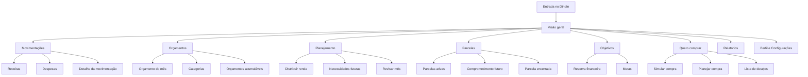
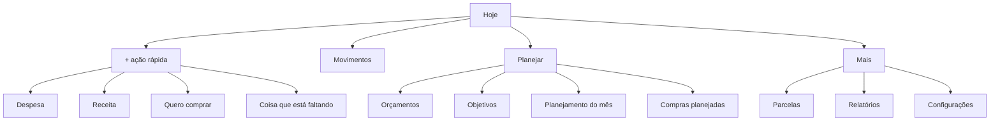

# DindIn — Mapa de Navegação e Arquitetura de Informação

## 1. Objetivo deste documento

Este documento define como as áreas do DindIn se organizam e como o usuário se desloca entre elas.

Ele não define arquitetura técnica, banco de dados ou implementação. Seu objetivo é alinhar UX, UI, produto e desenvolvimento sobre:

- quais áreas existem;
- qual é a tarefa mental de cada área;
- quais caminhos são principais;
- quais ações devem acontecer sem troca de página;
- como desktop/tablet e mobile diferem;
- como evitar redundância entre módulos.

A arquitetura de informação deve sustentar o princípio central do produto:

> **O DindIn ajuda o usuário a decidir antes de gastar e a entender o impacto das decisões depois que elas acontecem.**

---

## 2. Princípio de navegação por dispositivo

### Desktop e tablet

Tarefa mental principal:

> **Observar → entender → planejar → corrigir.**

Desktop e tablet são ambientes de análise. A navegação deve favorecer comparação, contexto e edição sem perda da visão geral.

### Mobile

Tarefa mental principal:

> **Registrar → consultar → decidir uma compra.**

Mobile é ambiente de ação rápida. Não deve tentar reproduzir integralmente o dashboard analítico.

> **Mobile não é dashboard reduzido. Desktop não é formulário ampliado.**

---

## 3. Estrutura principal do produto

O DindIn possui sete domínios principais:

1. **Visão geral** — entender a situação financeira atual;
2. **Movimentações** — registrar e consultar entradas e saídas;
3. **Orçamentos** — definir quanto pode ser usado em cada finalidade;
4. **Planejamento** — distribuir a renda antes de gastar;
5. **Parcelas** — visualizar compromissos de renda futura;
6. **Objetivos** — construir reservas e metas financeiras;
7. **Quero comprar** — analisar uma decisão antes da compra.

Áreas secundárias:

- Relatórios;
- Perfil;
- Configurações;
- Ajuda.

---

## 4. Mapa macro



---

# 5. Navegação Desktop

## 5.1 Sidebar principal

A sidebar é persistente e deve conter:

```text
Visão geral
Movimentações
Orçamentos
Planejamento
Parcelas
Objetivos
Quero comprar
Relatórios

----------------
Configurações
```

### Regras

- máximo de uma hierarquia principal visível;
- item ativo com fundo lilás suave e ícone roxo;
- sem submenus permanentes na sidebar;
- subtarefas aparecem dentro da página ou em drawers;
- a sidebar não deve competir visualmente com o conteúdo.

---

## 5.2 Barra superior

Elementos possíveis:

- busca contextual;
- seletor de mês/período;
- notificações;
- perfil;
- ações rápidas `+ Receita` e `+ Despesa` quando relevantes.

A barra superior não deve repetir a navegação da sidebar.

---

# 6. Visão geral / Home

## Tarefa mental

> **“Como está meu dinheiro agora e o que merece minha atenção?”**

A Home é o centro analítico do produto.

### Conteúdo prioritário

1. disponível para gastar;
2. receitas do período;
3. despesas do período;
4. valor reservado;
5. evolução do mês;
6. orçamentos relevantes;
7. compromissos futuros;
8. próximas parcelas;
9. insights comportamentais.

### Ações permitidas

- abrir detalhes de uma métrica;
- registrar receita/despesa;
- acessar orçamento;
- analisar uma compra;
- redirecionar valor liberado por parcela encerrada;
- trocar mês/período.

### Regra de contexto

Uma ação simples não deve obrigar o usuário a abandonar a Home.

Exemplo:

`Compras pessoais — 84% usado` → clique → drawer lateral com detalhes.

---

# 7. Movimentações

## Tarefa mental

> **“O que entrou, o que saiu e onde meu dinheiro foi usado?”**

### Estrutura

```text
Movimentações
├── Todas
├── Despesas
├── Receitas
└── Transferências
```

### Tela principal

Deve oferecer:

- busca;
- filtros por período;
- categoria;
- conta/forma de pagamento;
- tipo;
- ordenação;
- total do filtro atual.

### Detalhe da movimentação

No desktop, preferir drawer lateral.

Permitir:

- visualizar;
- editar;
- excluir;
- alterar categoria;
- alterar orçamento relacionado;
- ver impacto no mês.

### Nova despesa / nova receita

No desktop:

- modal ou drawer;
- sem troca de contexto.

No mobile:

- fluxo de tela cheia otimizado para rapidez.

---

# 8. Orçamentos

## Tarefa mental

> **“Quanto eu decidi permitir para cada parte da minha vida?”**

### Estrutura

```text
Orçamentos
├── Visão do mês
├── Obrigações
├── Consumo
├── Necessidades futuras
└── Reservas
```

### Orçamento do mês

Mostrar:

- planejado;
- gasto;
- restante;
- percentual;
- tendência;
- saldo acumulado quando aplicável.

### Categorias

Exemplos:

- moradia;
- estudos;
- mercado;
- compras pessoais;
- lazer;
- saúde;
- transporte.

### Ações

- criar orçamento;
- editar limite;
- ativar/desativar acúmulo;
- mover valor entre orçamentos;
- consultar histórico;
- acessar movimentações responsáveis pelo consumo.

### Regra de UX

Orçamento não é apenas relatório de gasto. Ele representa uma **decisão tomada antes do consumo**.

---

# 9. Planejamento

## Tarefa mental

> **“Como vou distribuir meu dinheiro antes de gastá-lo?”**

Planejamento é diferente de Orçamentos.

- **Planejamento** distribui a renda disponível;
- **Orçamento** define limites e destinos específicos.

### Estrutura

```text
Planejamento
├── Montar meu mês
├── Próximo mês
├── Necessidades futuras
└── Revisão do mês
```

## 9.1 Montar meu mês

Fluxo conceitual:

```text
Renda prevista
   ↓
Obrigações
   ↓
Reserva / Eu do futuro
   ↓
Necessidades futuras
   ↓
Limites de consumo
   ↓
Dinheiro livre
```

O objetivo visual é aproximar o valor “sem destino” de zero.

Isso não significa gastar todo o dinheiro; significa atribuir função a ele.

## 9.2 Próximo mês

Permite antecipar:

- renda esperada;
- parcelas;
- despesas recorrentes;
- valores liberados;
- reservas planejadas.

---

# 10. Parcelas

## Tarefa mental

> **“Quanto do meu futuro já está comprometido?”**

### Estrutura

```text
Parcelas
├── Ativas
├── Encerradas
└── Comprometimento futuro
```

### Parcela ativa

Mostrar:

- item;
- valor da parcela;
- parcela atual / total;
- meses restantes;
- valor total ainda comprometido;
- data final.

### Comprometimento futuro

Visão mensal dos valores já comprometidos.

Exemplo:

```text
Outubro      R$ 270
Novembro     R$ 270
Dezembro     R$ 270
Janeiro      R$ 270
Fevereiro    R$ 0
```

### Encerramento de parcela

Quando uma parcela terminar, criar um momento comportamental especial:

> **Mais espaço no seu mês.**
>
> R$ 190 foram liberados.

Ações:

- enviar para reserva;
- adicionar a um objetivo;
- redistribuir no orçamento;
- decidir depois.

Evitar sugerir uma nova parcela.

---

# 11. Objetivos

## Tarefa mental

> **“O que estou construindo com o dinheiro que não gasto hoje?”**

### Estrutura

```text
Objetivos
├── Reserva financeira
├── Metas ativas
└── Metas concluídas
```

### Exemplos

- reserva inicial de R$ 3.000;
- reserva de R$ 6.000;
- viagem;
- notebook;
- curso;
- mudança.

### Cada objetivo mostra

- valor atual;
- valor alvo;
- percentual;
- contribuição mensal;
- previsão aproximada;
- histórico.

---

# 12. Quero comprar

## Tarefa mental

> **“Esta compra cabe na minha vida financeira agora?”**

Essa é uma das áreas centrais de diferenciação do DindIn.

### Estrutura

```text
Quero comprar
├── Nova análise
├── Planejadas
├── Lista de desejos
└── Compras realizadas
```

## 12.1 Nova análise

O usuário informa:

- item;
- valor;
- necessidade ou desejo;
- quando precisa;
- à vista ou parcelado;
- número de parcelas.

O DindIn apresenta:

- orçamento disponível;
- quanto sobrará após a compra;
- impacto em objetivos;
- impacto em renda futura;
- melhor alternativa quando houver.

### Respostas possíveis

- cabe agora;
- cabe, mas reduz margem;
- melhor planejar;
- exige retirar dinheiro de outra finalidade;
- compromete despesas obrigatórias.

Nunca apresentar julgamento moral.

## 12.2 Compra planejada

Permite transformar desejo em objetivo:

```text
Notebook — R$ 3.000
Guardar R$ 500/mês
Compra prevista em 6 meses
```

---

# 13. “Coisas que estão faltando”

Essa função é transversal e não precisa ser uma página principal na primeira hierarquia.

Pode ser acessada por:

- Quero comprar;
- Planejamento;
- ação rápida `+`;
- sugestão contextual.

### Objetivo

Capturar necessidades percebidas antes que virem compras impulsivas.

Com o tempo, o sistema pode sugerir transformar recorrências em orçamento.

---

# 14. Relatórios

## Tarefa mental

> **“Como meu comportamento financeiro está mudando ao longo do tempo?”**

Relatórios são uma área secundária e não devem dominar a Home.

### Possíveis visões

- entradas x saídas;
- categorias;
- evolução do disponível;
- evolução da reserva;
- compras não planejadas;
- novas parcelas por período;
- aderência ao orçamento;
- comparação mês a mês.

### Regra

Toda visualização deve responder uma pergunta. Evitar gráficos puramente decorativos.

---

# 15. Navegação Mobile

A navegação inferior deve priorizar frequência de uso.

Proposta:

```text
Hoje     Movimentos       +       Planejar      Mais
```

### Hoje

- disponível para gastar;
- orçamentos principais;
- últimas movimentações;
- alerta útil do dia.

### Movimentos

- lista rápida;
- busca;
- filtros essenciais.

### Botão central `+`

Abre um action sheet:

```text
Registrar despesa
Registrar receita
Quero comprar
Coisa que está faltando
Transferir
```

### Planejar

Atalhos para:

- orçamento;
- objetivos;
- Quero comprar;
- planejamento do mês.

### Mais

- parcelas;
- relatórios;
- perfil;
- configurações;
- ajuda.

---

# 16. Mapa Mobile



---

# 17. Modal, drawer ou página?

Para evitar navegação excessiva, usar a seguinte regra.

## Drawer

Preferir no desktop quando o usuário precisa inspecionar ou editar algo sem perder contexto.

Exemplos:

- detalhe de movimentação;
- detalhe de orçamento;
- detalhe de parcela;
- edição rápida de categoria.

## Modal

Usar para operações curtas e focadas.

Exemplos:

- confirmar exclusão;
- mover dinheiro entre orçamentos;
- criar categoria simples.

## Página

Usar quando a tarefa exige análise, sequência ou contexto próprio.

Exemplos:

- Planejamento;
- Quero comprar;
- Objetivos;
- Relatórios.

## Mobile

No mobile, tarefas de entrada de dados normalmente usam tela completa ou bottom sheet, dependendo da complexidade.

---

# 18. Ligações transversais importantes

Os módulos não devem se comportar como silos.

### Movimentação → Orçamento

Toda despesa categorizada afeta o orçamento correspondente.

### Orçamento → Movimentações

Ao clicar no valor consumido, o usuário vê quais movimentações o compõem.

### Parcela → Planejamento

Parcelas futuras devem aparecer automaticamente como compromissos no planejamento mensal.

### Parcela encerrada → Objetivo/Reserva

O valor liberado pode ser redirecionado.

### Quero comprar → Orçamento

A simulação deve consultar orçamento antes da decisão.

### Quero comprar → Objetivo

Uma compra adiada pode virar meta.

### “Coisas que estão faltando” → Orçamento

Necessidades recorrentes podem se transformar em orçamento mensal.

---

# 19. Profundidade máxima de navegação

Evitar fluxos como:

```text
Home → Orçamento → Categoria → Grupo → Detalhe → Editar
```

Meta recomendada:

- no máximo **2 níveis de navegação estrutural**;
- detalhes adicionais via drawer/modal;
- ações críticas acessíveis em até 3 interações a partir da área principal.

---

# 20. Regras de preservação de contexto

Quando o usuário estiver analisando um mês, o sistema deve preservar:

- período selecionado;
- filtros ativos;
- posição de navegação;
- contexto da categoria;
- estado anterior ao abrir drawer/modal.

Fechar um detalhe deve devolver o usuário ao mesmo ponto da análise.

---

# 21. Estados vazios

Estados vazios devem ensinar a próxima ação.

### Sem movimentações

> **Seu mês começa aqui.**
>
> Registre sua primeira receita ou despesa.

### Sem orçamento

> **Dê uma função ao seu dinheiro.**
>
> Crie seu primeiro orçamento para saber quanto pode gastar sem culpa.

### Sem objetivo

> **Escolha algo para construir.**
>
> Pode ser sua reserva, uma viagem ou uma compra importante.

### Sem parcelas

> **Nenhuma renda futura comprometida por aqui.**

Evitar telas vazias puramente técnicas.

---

# 22. Hierarquia de frequência

## Alta frequência

- Hoje / Visão geral;
- Registrar despesa;
- Registrar receita;
- Movimentações;
- consultar orçamento;
- consultar disponível.

## Média frequência

- Quero comprar;
- Planejamento;
- Objetivos;
- Parcelas.

## Baixa frequência

- Relatórios detalhados;
- configurações;
- manutenção de categorias;
- perfil.

A posição na navegação deve refletir essa frequência.

---

# 23. Critérios para validar a arquitetura de informação

A arquitetura será considerada adequada quando o usuário conseguir:

1. descobrir quanto pode gastar sem procurar em várias telas;
2. registrar uma despesa no celular em poucos segundos;
3. entender por que um orçamento está acabando;
4. enxergar compromissos dos próximos meses;
5. simular uma compra antes de executá-la;
6. transformar uma compra futura em objetivo;
7. perceber quando uma parcela liberou renda;
8. analisar o mês no desktop sem navegar excessivamente;
9. diferenciar claramente orçamento, planejamento, parcela e objetivo;
10. voltar ao contexto anterior após consultar um detalhe.

---

# 24. Decisões aprovadas nesta etapa

A arquitetura de informação do DindIn assume como decisões oficiais:

- Home desktop/tablet é analítica;
- Home mobile é operacional;
- `Disponível para gastar` é o KPI protagonista;
- Orçamentos e Planejamento são áreas diferentes;
- `Quero comprar` é módulo principal, não funcionalidade escondida;
- Parcelas são tratadas como comprometimento de renda futura;
- detalhes simples usam drawers no desktop;
- mobile possui ação central de registro rápido;
- “Coisas que estão faltando” é recurso transversal;
- Relatórios são secundários e não substituem o dashboard;
- o app deve preservar contexto durante análise.

---

# 25. Próxima etapa

Após este mapa, a próxima documentação de UX deve definir **User Flows** completos para os principais comportamentos:

1. primeiro planejamento do mês;
2. registrar uma despesa;
3. registrar uma receita;
4. criar e acompanhar orçamento;
5. analisar `Quero comprar`;
6. compra adiada → objetivo;
7. criar necessidade em “Coisas que estão faltando”;
8. parcela encerrada → redistribuir dinheiro;
9. fechamento mensal;
10. replanejamento após estouro de orçamento.

Esses fluxos serão a base para os wireframes low-fidelity.